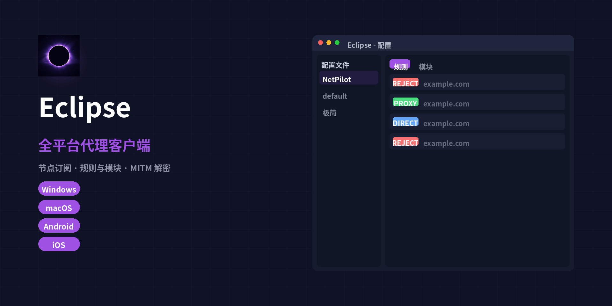

# Eclipse

Eclipse 是一款全平台代理客户端，支持 Android、iOS、Windows 与 macOS。



## 下载

在 [Releases](https://github.com/Unwhimsical/Eclipse/releases) 页面下载最新版本：

- **Windows**：安装包（`.exe`）或便携版（`.zip`）
- **macOS**：`.dmg`（Apple Silicon / Intel）
- **Android**：`.apk`
- **iOS**：未签名的 `.ipa`，需自行签名后安装

## 安装

### Windows / macOS / Android

下载对应安装包直接安装即可。Windows 也有便携版（zip），解压即用。

### iOS（需自行签名）

1. 在 Releases 页面下载未签名的 `.ipa`。
2. 用 [Sideloadly](https://sideloadly.io/)、AltStore 或 TrollStore 等工具签名安装。
3. 需要一个 Apple ID（免费的即可，7 天有效期）或付费开发者证书。

## MITM 证书风险提示

Eclipse 内置 CA 中心，可一键生成 MITM 根证书用于解密 HTTPS 流量（如去广告）。

⚠️ **风险提示**：
- 安装根证书意味着 Eclipse 可以解密你的 HTTPS 流量，请只在信任的设备上使用。
- 不要把生成的根证书私钥分享给他人。
- 仅对你明确需要解密的域名开启 MITM，不要全局解密。

## 支持的平台

| 平台 | 状态 |
|------|------|
| Windows (x64) | ✅ 安装包 / 便携版 |
| macOS (Apple Silicon / Intel) | ✅ DMG |
| Android (arm64) | ✅ APK |
| iOS | ✅ 未签名 IPA（需自行签名） |
| Linux | ✅ AppImage / deb / rpm |

## 功能特性

- **节点与订阅导入**：分享链接逐行导入、Base64 订阅导入
- **规则与模块**：`.conf` 配置导入、`.sgmodule` 模块导入（规则 / Host / URL Rewrite / Script / MITM，支持 `%APPEND%` 追加语义与模块参数）
- **应用内 CA 中心**：一键生成 MITM 根证书，附带安装与信任引导（Android / iOS）
- **MITM**：TLS 解密、Header 改写、Body 改写（jq）、Map Local
- **JS 脚本引擎**
- **场景模式**：按 Wi-Fi 名称 / 蜂窝网络自动切换配置
- **代理链**：节点 A 经节点 B 出站
- **其他**：延迟测试、代理共享、按需连接、统计分类、剪贴板导入、DNS / TUN / 代理设置
- **自动构建**：GitHub Actions 自动产出 Android APK、未签名 iOS IPA、Windows / macOS 桌面包

## 构建

```bash
# Android APK
dart setup.dart android -v
# iOS（未签名）
dart setup.dart ios -v
# Windows / macOS 桌面包
dart setup.dart windows -v
dart setup.dart macos -v
```

需要 Flutter 3.47.1，详见 `.github/workflows/`。

## 致谢

- 基于 [FlClash](https://github.com/chen08209/FlClash)（chen08209）二次开发
- iOS 移植参考 [flclash-patched](https://github.com/chenx-dust/flclash-patched)（chenx-dust）
- 代理核心 [mihomo](https://github.com/MetaCubeX/mihomo)（MetaCubeX）

详细第三方署名见 [ATTRIBUTION.md](ATTRIBUTION.md)。

## 开源协议

本项目遵循 GPL-3.0 开源协议，详见 [LICENSE](LICENSE)。
